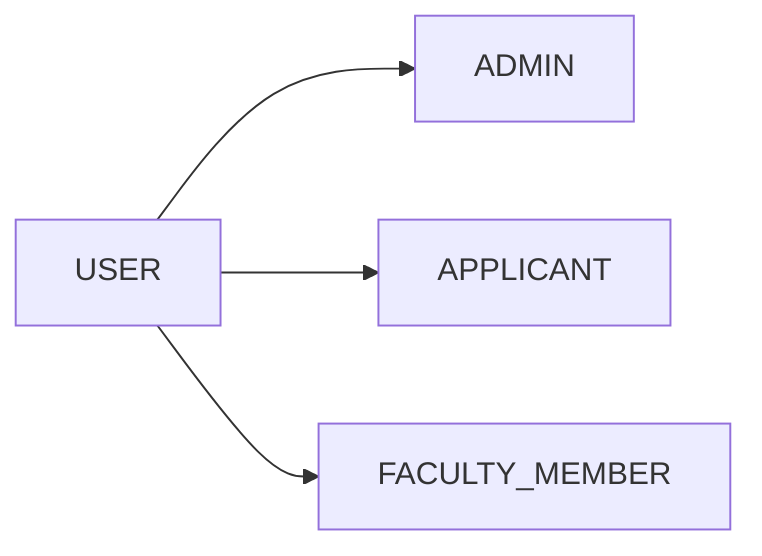
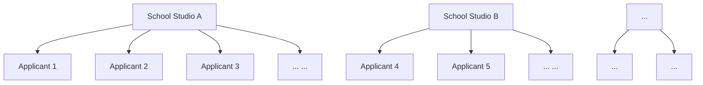
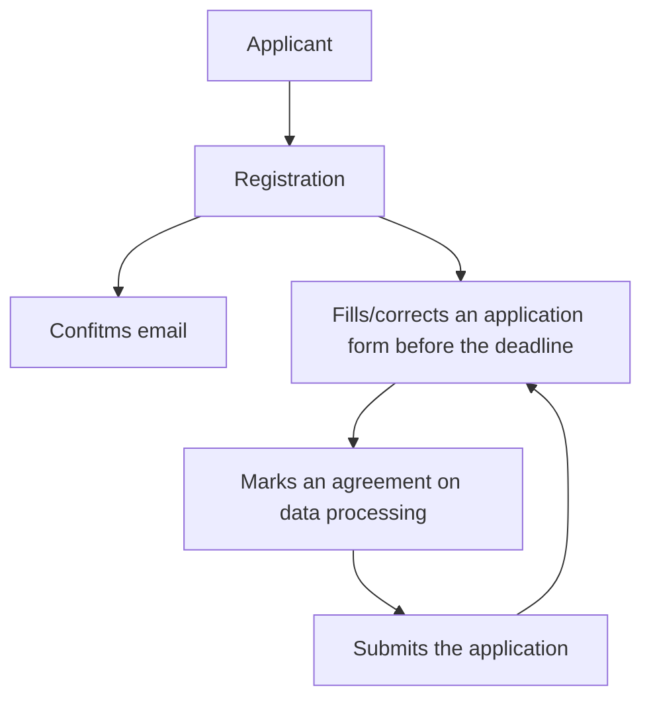
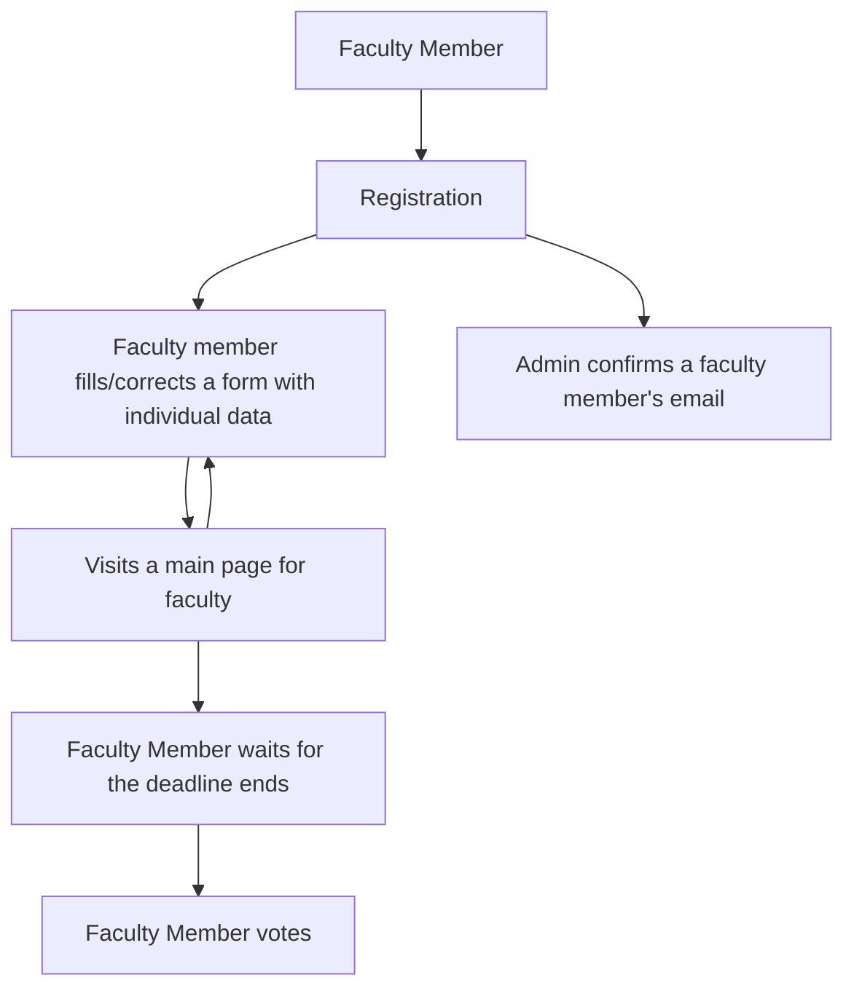
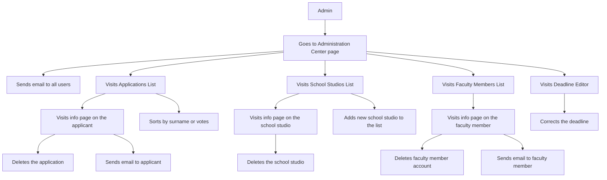

# IKMH Student Application Management System

The system is developed for International Kids Media House (Vienna, Austria).
The current version of the system is a demo version for testing and check the features.

Demo on Heroku: https://ikmh.kofedev.com

## Base conceptions

The entity USER is on the top of the hierarchy.

User's <b>Email</b> is used as a <i>login</i> and as a <i>username</i> in the table "users".

<b><i>Applicant</i></b> is a person (senior school student, 14-17 y.o.) who applies
for the IKMH educational program.

<b><i>Faculty Member</i></b> is a person who reviews and votes for the applications.  

<b><i>Admin</i></b> is a person who controls the system and can retrieve some statistic
information about the application process.

<b><i>School Studio</i></b>: as a rule, every applicants is a student (participant) of some school media studio.

### A base screnplay for Actor "Applicant (Student)"

### A base screenplay for Actor "Faculty Member"

### A base screenplay for Actor "Admin"

